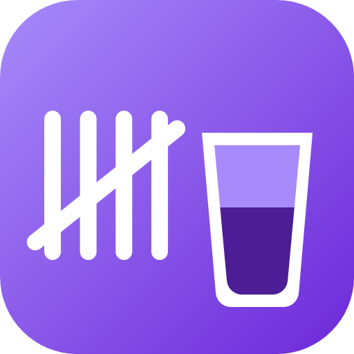

# Tally

**Party drinks, split fairly.** A Windows app for tracking the drinks you buy for a party, keeping a guest list of who owes what and who has paid, and printing it all out.

<br clear="left"/>

Built as a proper desktop program (C# / WPF / .NET 8) instead of the original HTML page it replaces. Everything is **saved automatically**, there's no save button. Available in German and English (switch anytime with the language button in the top-left corner).

### 📖 Step-by-step manual with screenshots

| | Read online | Download PDF |
|---|---|---|
| 🇩🇪 Deutsch | [docs/ANLEITUNG.md](docs/ANLEITUNG.md) | [Tally-Anleitung-DE.pdf](docs/Tally-Anleitung-DE.pdf) |
| 🇬🇧 English | [docs/MANUAL.md](docs/MANUAL.md) | [Tally-Manual-EN.pdf](docs/Tally-Manual-EN.pdf) |

## Download & run

No installation needed — just one file.

1. Go to **[Releases](../../releases/latest)** and download `Tally.exe`.
2. Double-click it. That's it.

On first launch, Windows may show a **"Windows protected your PC"** SmartScreen warning, because the .exe isn't code-signed. Click **More info → Run anyway**. This is expected for a small independent app and only appears once.

Requires Windows 10 or 11. The download is self-contained (~140 MB) and bundles its own .NET runtime, so nothing else needs to be installed.

## Features

- Track drinks per party: name, category, quantity, unit price, total price, store
- **Guest list**: what each guest owes, what they've paid, and what's still open — amounts are always yours to type, nothing is split automatically
- **Result**: what you spent on drinks against what you've actually collected, so you can see when the party has paid for itself
- Automatic saving, rolling backups, and one-click restore from any previous backup
- Print or export to PDF — the drinks invoice and the guest list print as separate sheets
- Import data exported from the old HTML version
- Light and dark theme
- German and English UI, switchable at any time
- Your data stays on your own PC — nothing is uploaded anywhere

## Where your data lives

| What | Where |
|---|---|
| Your data | `Documents\Tally\tally.json` |
| Automatic backups | `Documents\Tally\Backups\` |
| Settings (folder, theme, language, window size) | `%LOCALAPPDATA%\Tally\settings.json` |
| Error log | `%LOCALAPPDATA%\Tally\log.txt` |

You can change the storage folder from within the app (bottom-left, *Change …*) — for example to move it onto OneDrive or a USB stick. Your data is carried over to the new folder automatically; if a data file already exists there, you'll be asked which one should win.

> **Upgrading from the old *PartyRechnungen* version?** Nothing to do. On first launch Tally copies your data, backups and settings from the old folders into the new ones. The old folders are **copied, never moved or deleted**, so your previous data stays exactly where it was as a safety net — delete it yourself once you're happy.

## How saving works

- Every change is written to disk automatically within about a second — safely: first to a temp file, then swapped in atomically. A crash mid-write can never corrupt the file.
- If saving fails (folder unreachable, file locked, ...) the app shows it in the save-status panel and retries every 5 seconds. It also saves once more on exit, and asks first if that fails.
- Backups are taken on startup, every 10 minutes if something changed, and on exit. The newest 20 automatic backups are kept, plus the last one per day for 30 days, plus your newest 50 manual/safety backups. Use *Backups …* to browse and restore any of them — the current state is backed up first, so nothing is lost.
- If the data file ever gets corrupted, the app automatically loads the newest valid backup and tells you what happened.
- Only one copy of the app can run at a time, so two windows can't overwrite each other's saves.

## Importing data from the old HTML version

In the old page: *Export* → save the JSON file. In this app: *Import* (bottom-left) → pick that file. The file format is unchanged.

## Printing / PDF

*Print / PDF* (top-right) or **Ctrl+P**. For a PDF file, choose the **"Microsoft Print to PDF"** printer in the print dialog.

## Keyboard shortcuts

- **Enter** in the drink field applies the highlighted suggestion and jumps to quantity; in the other fields, Enter saves the item.
- **↑ / ↓** picks a suggestion, **Tab** applies it, **Esc** closes the suggestion list.
- **Esc** cancels editing an item.

## Building from source

If you'd rather build it yourself instead of downloading a release:

- **.NET 8 SDK** (not just the runtime): https://dotnet.microsoft.com/download/dotnet/8.0
- VS Code with the **C# Dev Kit** extension, or any editor of your choice

```bash
git clone https://github.com/Sam-218/Tally.git
cd Tally
dotnet build
```

Run it with **F5** in VS Code, or `dotnet run`.

> **Building on a Mac?** The app itself only runs on Windows, but the project is set up to *build* on macOS/Linux too (`EnableWindowsTargeting`) — build the .exe there and copy it to a Windows PC. This path is untested; building directly on Windows is the safe option.

### Producing your own .exe

From the project folder:

```bash
# Single .exe, runs on any Windows PC, no .NET install required (~140 MB)
dotnet publish -c Release -r win-x64 --self-contained -o publish

# Small .exe (~2 MB); the PC needs the ".NET 8 Desktop Runtime" installed
dotnet publish -c Release -r win-x64 --self-contained false -p:PublishSingleFile=true -o publish-klein
```

The result is `publish\Tally.exe` (or `publish-klein\Tally.exe`) — a single file with no other dependencies, copy it anywhere.

## Project status

Working and in everyday use. The app has been manually tested on Windows 10 and 11 — there is no automated test suite yet.

## License

Released under the [MIT License](LICENSE) — free to use, modify and share.
