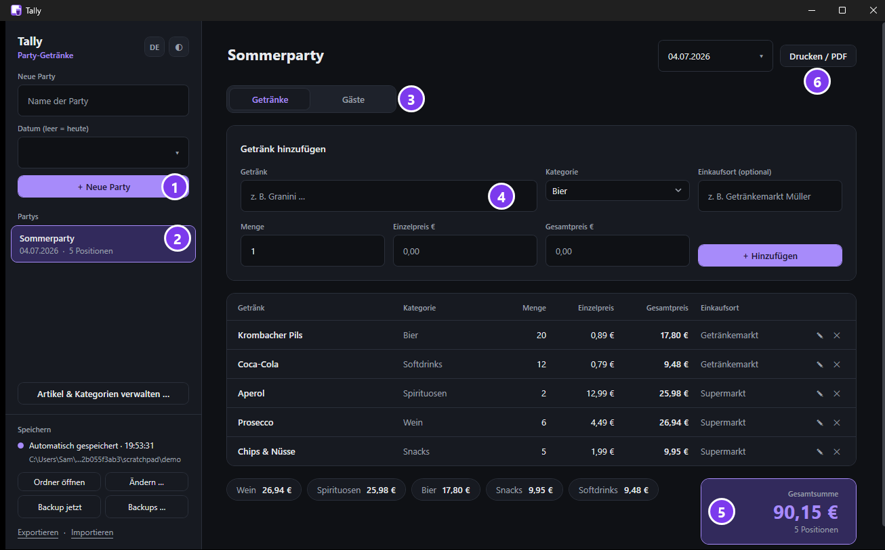
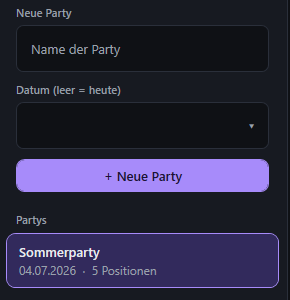
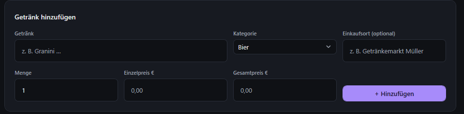
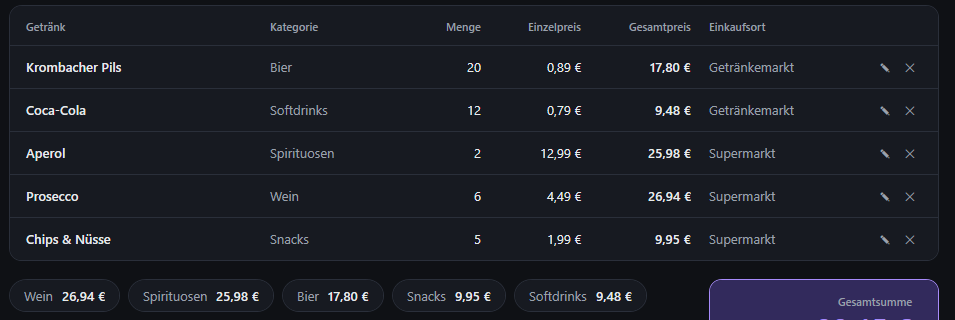
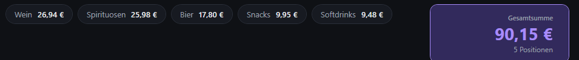
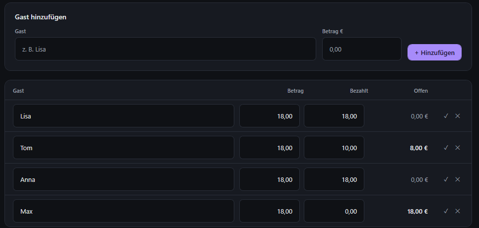
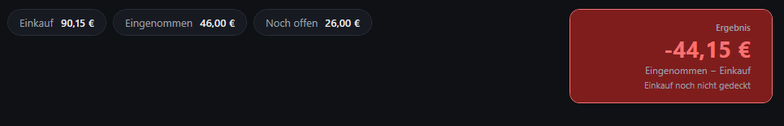
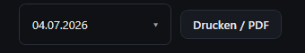
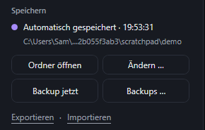
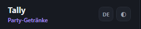

# Tally — Anleitung

**Getränke für die Party eintragen, und festhalten wer was zahlt.**

 

Diese Anleitung erklärt alles Schritt für Schritt. Du brauchst keine Vorkenntnisse.

🇬🇧 [English version](MANUAL.md)  ·  📄 [Als PDF herunterladen](Tally-Anleitung-DE.pdf)

---

## Inhalt

1. [Programm starten](#1-programm-starten)
2. [Der Überblick](#2-der-überblick)
3. [Eine Party anlegen](#3-eine-party-anlegen)
4. [Getränke eintragen](#4-getränke-eintragen)
5. [Gäste: wer zahlt was](#5-gäste-wer-zahlt-was)
6. [Das Ergebnis](#6-das-ergebnis)
7. [Drucken oder als PDF speichern](#7-drucken-oder-als-pdf-speichern)
8. [Speichern und Backups](#8-speichern-und-backups)
9. [Sprache und Design](#9-sprache-und-design)
10. [Tastenkürzel](#10-tastenkürzel)
11. [Häufige Fragen](#11-häufige-fragen)

---

## 1. Programm starten

Du brauchst nur **eine einzige Datei**: `Tally.exe`. Doppelklick — fertig. Es muss nichts installiert werden.

> **Beim ersten Start sagt Windows vielleicht „Der Computer wurde durch Windows geschützt".**
> Das ist normal. Klicke auf **Weitere Informationen** → **Trotzdem ausführen**.
> Die Meldung kommt nur einmal.

---

## 2. Der Überblick

So sieht das Fenster aus. Die sechs Stellen, die du brauchst:

| | Was ist das? |
|---|---|
| **1** | Hier legst du eine **neue Party** an |
| **2** | Deine **Partys**. Klick eine an, um sie zu öffnen |
| **3** | Umschalter: **Getränke** oder **Gäste** |
| **4** | Hier trägst du ein **Getränk** ein |
| **5** | Die **Gesamtsumme** — was du ausgegeben hast |
| **6** | **Drucken** oder als PDF speichern |

---

## 3. Eine Party anlegen

1. Schreibe oben einen **Namen** hinein, zum Beispiel `Sommerparty`.
2. Wähle darunter ein **Datum**. Lässt du das Feld leer, nimmt das Programm heute.
3. Klick auf **+ Neue Party**.

Die Party erscheint jetzt in der Liste darunter. Du kannst beliebig viele Partys anlegen und jederzeit zwischen ihnen wechseln.

> **Tipp:** Den Namen kannst du später ändern — klick oben im Fenster einfach auf den Titel und tippe drauflos.

---

## 4. Getränke eintragen

Für jedes Getränk, das du gekauft hast:

1. **Getränk** — der Name, zum Beispiel `Krombacher Pils`.
   Während du tippst, schlägt das Programm passende Getränke vor. Mit **Enter** übernimmst du einen Vorschlag.
2. **Kategorie** — zum Beispiel Bier, Wein, Softdrinks. Wähle sie aus der Liste.
3. **Einkaufsort** — freiwillig, zum Beispiel `Getränkemarkt`.
4. **Menge** — wie viele Flaschen oder Kästen.
5. **Einzelpreis** — was *ein* Stück kostet.
   Den **Gesamtpreis** rechnet das Programm selbst aus.
6. Klick auf **+ Hinzufügen**.

> Du kennst nur den Gesamtpreis, zum Beispiel vom Kassenbon? Dann trag **Menge** und **Gesamtpreis** ein — der Einzelpreis wird automatisch berechnet.

Alle Getränke stehen danach in der Liste:

- Mit dem **Stift** ✎ änderst du eine Zeile.
- Mit dem **Kreuz** ✕ löschst du sie.

Ganz unten siehst du, was du insgesamt ausgegeben hast — und pro Kategorie:

---

## 5. Gäste: wer zahlt was

Klick oben auf **Gäste**.

**Einen Gast eintragen:**

1. **Name** eingeben, zum Beispiel `Lisa`.
2. **Betrag** eingeben — was dieser Gast zahlen soll.
3. Klick auf **+ Hinzufügen**.

**Wenn jemand zahlt:**

Schreib den Betrag einfach in die Spalte **Bezahlt**. Die Spalte **Offen** rechnet sich sofort selbst aus.

- Hat jemand **alles** bezahlt? Dann klick auf den **Haken** ✓ — das trägt den vollen Betrag ein.
- Jemand hat nur einen Teil gezahlt? Dann tipp den Teilbetrag ein, zum Beispiel `10,00`. Bei Tom oben stehen so noch `8,00 €` offen.
- Mit dem **Kreuz** ✕ löschst du einen Gast. Du wirst vorher gefragt.

> **Wichtig:** Die Beträge bestimmst immer **du**. Das Programm teilt nichts von allein auf und ändert nie eine Zahl, die du eingetragen hast.

---

## 6. Das Ergebnis

Ganz unten auf der Gäste-Seite steht, wie die Party finanziell steht:

| | Bedeutung |
|---|---|
| **Einkauf** | Was du für die Getränke ausgegeben hast |
| **Eingenommen** | Was deine Gäste dir schon **gezahlt** haben |
| **Noch offen** | Was dir noch fehlt |
| **Ergebnis** | Eingenommen − Einkauf |

**Das Ergebnis ist am Anfang rot und negativ — das ist völlig normal.** Du hast die Getränke ja bezahlt, bevor jemand dir Geld gegeben hat. Je mehr Gäste zahlen, desto weiter steigt die Zahl. Sobald sie grün wird, hat die Party sich selbst getragen.

---

## 7. Drucken oder als PDF speichern

Der Knopf oben rechts druckt **das, was du gerade siehst**:

- Du bist auf **Getränke**? → es wird die **Getränke-Rechnung** gedruckt.
- Du bist auf **Gäste**? → es wird die **Gästeliste** gedruckt.

Du bekommst also zwei getrennte Blätter — praktisch, wenn du die Gästeliste herumgeben willst.

**Als PDF speichern:** Wähle im Druckfenster den Drucker **„Microsoft Print to PDF"**. Dann wird statt Papier eine PDF-Datei erzeugt.

Du kannst auch **Strg + P** drücken.

---

## 8. Speichern und Backups

**Du musst nie auf Speichern klicken.** Jede Änderung wird nach etwa einer Sekunde automatisch gespeichert. Der Punkt links zeigt dir, dass alles gesichert ist.

Die Knöpfe darunter:

| Knopf | Was er macht |
|---|---|
| **Ordner öffnen** | Zeigt dir deine Dateien im Explorer |
| **Ändern …** | Legt einen anderen Speicherort fest, zum Beispiel USB-Stick oder OneDrive |
| **Backup jetzt** | Macht sofort eine Sicherheitskopie |
| **Backups …** | Zeigt alle früheren Stände — du kannst jeden wiederherstellen |
| **Exportieren** | Speichert alles in eine Datei, zum Weitergeben |
| **Importieren** | Lädt so eine Datei wieder ein |

> Sicherungen werden **automatisch** angelegt: beim Start, alle 10 Minuten und beim Beenden. Wenn du etwas wiederherstellst, wird vorher dein aktueller Stand gesichert — du kannst also nichts verlieren.

**Wo liegen meine Daten?**

| Was | Wo |
|---|---|
| Deine Daten | `Dokumente\Tally\tally.json` |
| Sicherungen | `Dokumente\Tally\Backups\` |

Alles bleibt auf deinem eigenen PC. Nichts wird ins Internet hochgeladen.

---

## 9. Sprache und Design

Oben links, neben dem Namen:

- **DE / EN** schaltet zwischen **Deutsch und Englisch** um.
- Der **Kreis** ◐ schaltet zwischen **hellem und dunklem Design** um.

Beides kannst du jederzeit umstellen. Das Programm merkt sich deine Wahl.

---

## 10. Tastenkürzel

| Taste | Wirkung |
|---|---|
| **Enter** im Getränke-Feld | Übernimmt den Vorschlag und springt zur Menge |
| **Enter** in den anderen Feldern | Speichert den Eintrag |
| **↑ / ↓** | Wählt einen Vorschlag aus |
| **Tab** | Übernimmt den Vorschlag |
| **Esc** | Schließt die Vorschlagsliste, oder bricht das Bearbeiten ab |
| **Strg + P** | Drucken |

---

## 11. Häufige Fragen

**Muss ich speichern?**
Nein. Das passiert automatisch.

**Kann ich das Programm auf einen USB-Stick legen?**
Ja. Kopier die `Tally.exe` einfach drauf. Mit **Ändern …** kannst du auch deine Daten auf den Stick legen.

**Ich habe aus Versehen etwas gelöscht.**
Klick auf **Backups …** und stell einen früheren Stand wieder her. Dein jetziger Stand wird vorher automatisch gesichert.

**Kann ich mehrere Partys gleichzeitig führen?**
Ja, beliebig viele. Jede hat ihre eigenen Getränke und Gäste.

**Warum ist das Ergebnis rot?**
Weil du bisher mehr ausgegeben hast, als du eingenommen hast. Das ist am Anfang immer so. Siehe [Das Ergebnis](#6-das-ergebnis).

**Rechnet das Programm die Beträge für meine Gäste aus?**
Nein, das machst du bewusst selbst. So kannst du frei entscheiden — zum Beispiel, dass jemand weniger zahlt, weil er nur Wasser getrunken hat.

**Die Zahlen stehen mit Komma statt Punkt.**
Das ist Absicht: Preise werden immer deutsch dargestellt (`12,50 €`), auch wenn du die Oberfläche auf Englisch stellst. Beim Eingeben darfst du aber beides tippen — `12,50` und `12.50` funktionieren.
