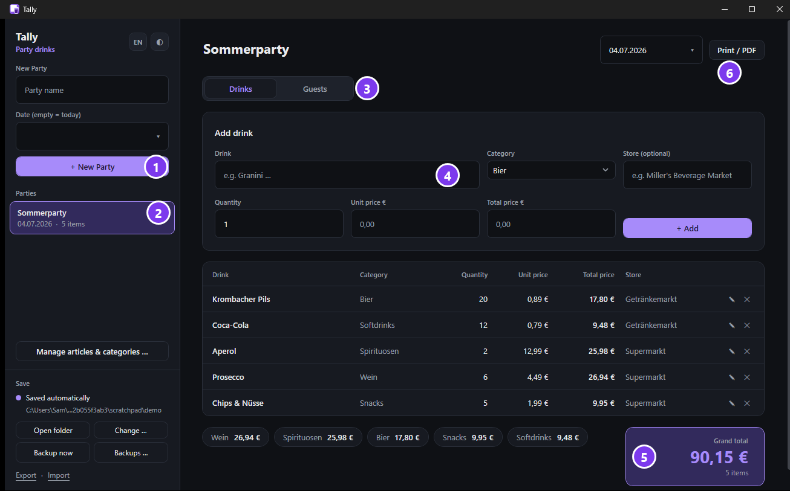
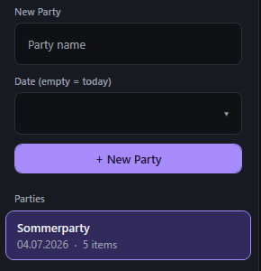
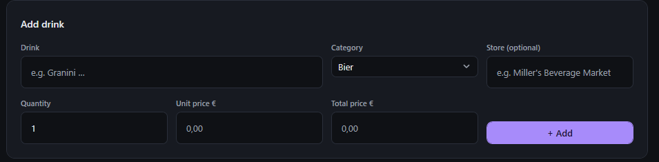
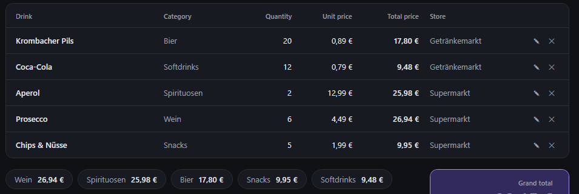
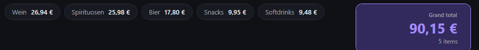
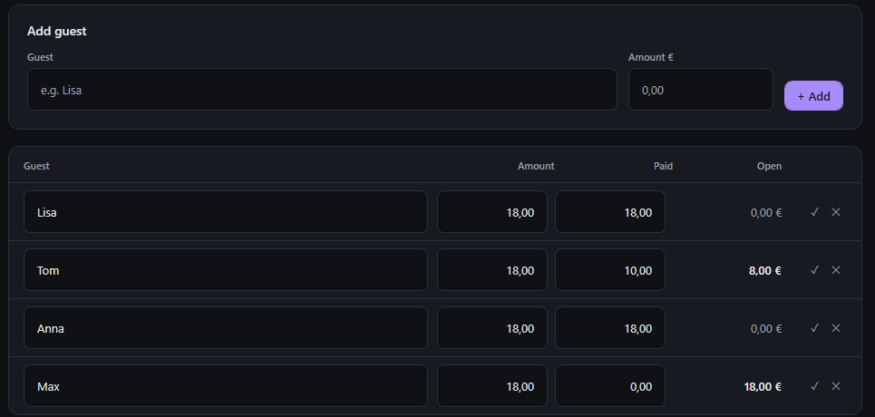
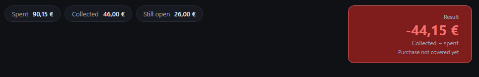
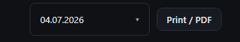
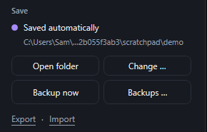
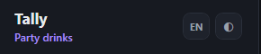

# Tally — Manual

**Track the drinks you buy for a party, and who pays what.**

 

This manual walks you through everything step by step. No prior knowledge needed.

🇩🇪 [Deutsche Fassung](ANLEITUNG.md)  ·  📄 [Download as PDF](Tally-Manual-EN.pdf)

---

## Contents

1. [Starting the program](#1-starting-the-program)
2. [The overview](#2-the-overview)
3. [Creating a party](#3-creating-a-party)
4. [Entering drinks](#4-entering-drinks)
5. [Guests: who pays what](#5-guests-who-pays-what)
6. [The result](#6-the-result)
7. [Printing or saving as PDF](#7-printing-or-saving-as-pdf)
8. [Saving and backups](#8-saving-and-backups)
9. [Language and theme](#9-language-and-theme)
10. [Keyboard shortcuts](#10-keyboard-shortcuts)
11. [Frequently asked questions](#11-frequently-asked-questions)

---

## 1. Starting the program

You only need **one single file**: `Tally.exe`. Double-click it — done. Nothing has to be installed.

> **On the first start Windows may say "Windows protected your PC".**
> That's expected. Click **More info** → **Run anyway**.
> The message only appears once.

---

## 2. The overview

This is the window. The six places you need:

| | What is it? |
|---|---|
| **1** | Create a **new party** here |
| **2** | Your **parties**. Click one to open it |
| **3** | Switch between **Drinks** and **Guests** |
| **4** | Enter a **drink** here |
| **5** | The **grand total** — what you have spent |
| **6** | **Print**, or save as PDF |

---

## 3. Creating a party

1. Type a **name** at the top, for example `Summer party`.
2. Pick a **date** below it. Leave it empty and the program uses today.
3. Click **+ New Party**.

The party now appears in the list underneath. You can create as many parties as you like and switch between them at any time.

> **Tip:** You can rename a party later — just click its title at the top of the window and start typing.

---

## 4. Entering drinks

For every drink you bought:

1. **Drink** — the name, for example `Krombacher Pils`.
   As you type, the program suggests matching drinks. Press **Enter** to accept a suggestion.
2. **Category** — for example beer, wine, soft drinks. Pick one from the list.
3. **Store** — optional, for example `Supermarket`.
4. **Quantity** — how many bottles or crates.
5. **Unit price** — what *one* of them costs.
   The **total price** is worked out for you.
6. Click **+ Add**.

> Only know the total, say from the receipt? Then enter **quantity** and **total price** — the unit price is calculated automatically.

All drinks then appear in the list:

- The **pencil** ✎ edits a row.
- The **cross** ✕ deletes it.

At the bottom you see what you have spent in total, and per category:

---

## 5. Guests: who pays what

Click **Guests** at the top.

**Adding a guest:**

1. Enter a **name**, for example `Lisa`.
2. Enter an **amount** — what this guest should pay.
3. Click **+ Add**.

**When someone pays:**

Just type the amount into the **Paid** column. The **Open** column updates itself instantly.

- Has someone paid **in full**? Click the **tick** ✓ — that fills in the whole amount.
- Someone paid only part of it? Type the part, for example `10,00`. Tom above still has `8,00 €` outstanding.
- The **cross** ✕ deletes a guest. You'll be asked first.

> **Important:** The amounts are always **yours** to decide. The program never splits anything on its own and never changes a number you typed.

---

## 6. The result

At the bottom of the Guests page you see how the party stands financially:

| | Meaning |
|---|---|
| **Spent** | What the drinks cost you |
| **Collected** | What your guests have actually **paid** you |
| **Still open** | What you are still owed |
| **Result** | Collected − spent |

**At the start the result is red and negative — that is completely normal.** You paid for the drinks before anyone gave you money. The more guests pay, the higher the number climbs. Once it turns green, the party has paid for itself.

---

## 7. Printing or saving as PDF

The button in the top right prints **whatever you are looking at**:

- On the **Drinks** tab → it prints the **drinks invoice**.
- On the **Guests** tab → it prints the **guest list**.

So you get two separate sheets — handy if you want to pass the guest list around.

**Saving as PDF:** In the print dialog, choose the printer **"Microsoft Print to PDF"**. That produces a PDF file instead of paper.

You can also press **Ctrl + P**.

---

## 8. Saving and backups

**You never have to click Save.** Every change is saved automatically after about a second. The dot on the left tells you everything is stored.

The buttons below:

| Button | What it does |
|---|---|
| **Open folder** | Shows your files in Explorer |
| **Change …** | Picks a different storage location, e.g. a USB stick or OneDrive |
| **Backup now** | Makes a backup immediately |
| **Backups …** | Shows all earlier versions — you can restore any of them |
| **Export** | Saves everything into one file, to pass on |
| **Import** | Loads such a file back in |

> Backups are made **automatically**: on startup, every 10 minutes and on exit. When you restore something, your current state is backed up first — so you cannot lose anything.

**Where is my data?**

| What | Where |
|---|---|
| Your data | `Documents\Tally\tally.json` |
| Backups | `Documents\Tally\Backups\` |

Everything stays on your own PC. Nothing is uploaded anywhere.

---

## 9. Language and theme

Top left, next to the name:

- **DE / EN** switches between **German and English**.
- The **circle** ◐ switches between **light and dark theme**.

You can change both at any time. The program remembers your choice.

---

## 10. Keyboard shortcuts

| Key | Effect |
|---|---|
| **Enter** in the drink field | Accepts the suggestion and jumps to quantity |
| **Enter** in the other fields | Saves the entry |
| **↑ / ↓** | Picks a suggestion |
| **Tab** | Accepts the suggestion |
| **Esc** | Closes the suggestion list, or cancels editing |
| **Ctrl + P** | Print |

---

## 11. Frequently asked questions

**Do I have to save?**
No. It happens automatically.

**Can I put the program on a USB stick?**
Yes. Just copy `Tally.exe` onto it. With **Change …** you can put your data on the stick too.

**I deleted something by accident.**
Click **Backups …** and restore an earlier version. Your current state is backed up first.

**Can I run several parties at once?**
Yes, as many as you like. Each has its own drinks and guests.

**Why is the result red?**
Because so far you have spent more than you have taken in. That is always the case at the start. See [The result](#6-the-result).

**Does the program work out the amounts for my guests?**
No, you do that deliberately yourself. That way you stay free to decide — for example that someone pays less because they only drank water.

**The prices use a comma instead of a point.**
That's on purpose: amounts are always shown in German format (`12,50 €`), even with the interface in English. When typing you may use either — `12,50` and `12.50` both work.

**The categories are in German.**
The built-in list of drinks and categories ships in German, because that's where the app comes from. You can rename them, delete them or add your own under **Manage articles & categories …**.
